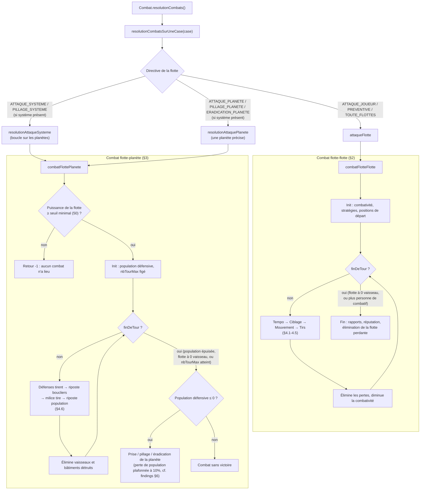

# Combat : algorithme constaté

Description du fonctionnement réel de `Combat.java`, tel que reconstitué en
écrivant des tests de caractérisation (`src/test/java/zIgzAg/jeu/oceane/
CombatFlotteFlotteTest.java`, `CombatFlottePlaneteTest.java`) et en lisant le
code source. C'est une description du comportement **actuel**, pas une
spécification voulue — voir `doc/combat-comportements-non-documentes.md`
pour les points qui surprennent le plus.

Toutes les classes citées sont dans `src/main/java/zIgzAg/jeu/oceane/`.

## 1. Vue d'ensemble

```
Combat.resolutionCombats()
  └─ pour chaque case de l'univers ayant des flottes en directive :
     Combat.resolutionCombatsSurUneCase(flottes, position)
       ├─ DIRECTIVE_FLOTTE_ATTAQUE_JOUEUR      → attaqueFlotte (flotte contre flotte, ciblée)
       ├─ DIRECTIVE_FLOTTE_ATTAQUE_PREVENTIVE  → attaqueFlotte (contre toute flotte offensive présente)
       ├─ DIRECTIVE_FLOTTE_ATTAQUE_TOUTE_FLOTTES → attaqueFlotte (contre toute flotte adverse)
       └─ si un système existe sur la case :
          ├─ DIRECTIVE_FLOTTE_ATTAQUE_SYSTEME / PILLAGE_SYSTEME
          │     → resolutionAttaqueSysteme → combatFlottePlanete (planète par planète)
          └─ DIRECTIVE_FLOTTE_ATTAQUE_PLANETE / PILLAGE_PLANETE / ERADICATION_PLANETE
                → resolutionAttaquePlanete → combatFlottePlanete (une planète précise)
```

`attaqueFlotte` appelle `combatFlotteFlotte` (§2) ; `resolutionAttaqueSysteme`
et `resolutionAttaquePlanete` appellent `combatFlottePlanete` (§3). Ce sont
les deux seules fonctions qui font le calcul de combat proprement dit — tout
le reste dans `Combat.java` est de la logique d'ordonnancement, de rapport
(HTML) ou d'évènements.

### Schéma d'ensemble



### Qui peut combattre qui

`Combat.peutCombattre(c1, c2)` (utilisé avant chaque affrontement) refuse le
combat si :
- `c1 == c2` (un commandant ne s'attaque pas lui-même) ;
- `c1` a un pacte de non-agression avec `c2` ;
- `c1` et `c2` appartiennent à une alliance commune (`commandantsAllies`).

### Ordre de résolution sur une case

Pour chaque type de directive, l'ordre de traitement des flottes candidates
est tiré au hasard (`Utile.ordreAuHasard`, voir sa caractérisation dans
`UtileOrdreAuHasardTest`) — mais les *types* de directive eux-mêmes sont
traités dans un ordre fixe et non paramétrable : attaques de flotte
d'abord (joueur, préventive, toutes flottes), puis, si un système existe,
attaques de système, pillage de système, attaque de planète, pillage de
planète, éradication de planète, dans cet ordre précis.

## 2. Combat flotte contre flotte — `Combat.combatFlotteFlotte`

```
combatFlotteFlotte(c1, c2, numFlotte1, numFlotte2)
├─ initialisation
│   f1 = c1.getFlotte(numFlotte1) ; f2 = c2.getFlotte(numFlotte2)
│   h1/h2 = héros embarqué (Heros.HEROS_NON_PRESENT si absent)
│   f1.calculeCombativite(h1) ; f2.calculeCombativite(h2)
│   s1 = c1.getStrategie(f1.getStrategie()) ; s2 = idem pour c2
│   hp1/hp2 = positionnement initial (Position3D 3D, voir §4.1)
│   hc1/hc2 = cibles initiales (vides)
│
├─ boucle de round, tant que !finDeTour :
│   ├─ détermination du tempo de chaque vaisseau (§4.2)
│   ├─ détermination de cible pour chaque vaisseau (§4.3)
│   ├─ mouvement de chaque vaisseau vers sa cible (ou fuite, §4.4)
│   ├─ résolution des tirs, dans l'ordre de tempo décroissant (§4.5)
│   ├─ élimination des vaisseaux détruits (Flotte.eliminerPertesVaisseaux)
│   ├─ diminution de la combativité de tous les vaisseaux survivants
│   └─ condition d'arrêt : une flotte est réduite à 0 vaisseau, OU
│      aucune des deux flottes n'a plus un seul vaisseau "combatif"
│      (combativité > 0)
│
└─ fin de combat
    récupération de cargaison, journalisation, mise à jour de réputation,
    génération de débris si dégâts cumulés > 200, élimination de la flotte
    perdante (Commandant.eliminerFlotte), et réinitialisation de la
    directive des deux flottes à NEUTRE — sauf si l'écart de puissance est
    tel qu'une flotte "garde" sa directive (puissance ≥ 5× celle de
    l'adversaire, calculé *avant* le combat).
```

Le combat s'arrête donc soit par anéantissement d'un camp, soit par
épuisement simultané de la combativité des deux camps (les vaisseaux
survivants restent alors face à face, invaincus des deux côtés).

## 3. Combat flotte contre planète — `Combat.combatFlottePlanete`

```
combatFlottePlanete(c1, numFlotte, c2, systeme, numPlanete, tour, dommagesFlotte)
├─ porte d'entrée
│   f = c1.getFlotte(numFlotte)
│   si f.getPuissance() < Const.PUISSANCE_ATTAQUE_PLANETAIRE_MINIMALE (50)
│       → abandon immédiat, retour -1, AUCUN combat n'a lieu
│
├─ initialisation
│   h = héros embarqué ; g = gouverneur adverse sur la possession (ou
│       Gouverneur.GOUVERNEUR_NON_PRESENT)
│   nbTourMax = f.calculeCombativiteMoyenne(h)   — figé pour tout le combat
│   strategie = c1.getStrategie(f.getStrategie())
│   nbPopDefensive = populationTotale × stabilite / 100, majorée si la
│       possession est en politique de défense ou dispose d'un stock
│       d'armement important
│
├─ boucle de round, tant que !finDeTour :
│   │  (numTour va de `tour` à nbTourMax exclu)
│   ├─ préparation : f.preparerAuCombat(false) ; classement des vaisseaux
│   │     assaillants en deux groupes selon l'agressivité de la stratégie :
│   │       strato = vaisseaux "stratosphériques" (bombardiers, selon
│   │                l'agressivité — vide pour une stratégie sans bombardier)
│   │       sol    = les autres vaisseaux assaillants
│   │
│   ├─ 1. tir des défenses planétaires (batteries réelles de la planète)
│   │     sur `strato` si non vide, sinon sur `sol` — à bout portant
│   │     (Combat.tirDefensesPlanetaires, voir §4.6)
│   ├─ 2. riposte des vaisseaux `strato` sur les boucliers/bâtiments
│   │     (Combat.tirAirSol, construCible=true)
│   ├─ 3. tir de la milice (Combat.tirMilicesPlanetaires, voir §4.6 et
│   │     `doc/combat-comportements-non-documentes.md` §3) sur `sol`
│   ├─ élimination des bâtiments détruits (Planete.eliminerPertesBatiments)
│   ├─ 4. riposte des vaisseaux `sol` sur la population/les bâtiments
│   │     restants (Combat.tirAirSol, construCible=false — voir
│   │     `doc/combat-comportements-non-documentes.md` §4)
│   ├─ élimination des vaisseaux et bâtiments détruits
│   └─ condition d'arrêt : population défensive ≤ 0, OU flotte réduite à
│      0 vaisseau, OU numTour == nbTourMax
│
└─ fin de combat
    f.finaliserCombat()
    si population défensive ≤ 0 :
        selon la directive de la flotte (attaque/pillage/éradication de
        système ou de planète), transfert de propriété de la planète
        (Commandant.transfertPlanete), pillage (transfert au commandant
        neutre + butin) ou éradication (repeuplement à zéro) — voir le
        plafond de perte de population décrit au §6 de
        `doc/combat-comportements-non-documentes.md`
    sinon :
        évènement "combat sans victoire" pour les deux camps
    dans tous les cas : perte de population plafonnée à 10 % de la
    population de départ (voir même document), destruction de la flotte
    assaillante si elle a perdu tous ses vaisseaux, réinitialisation de sa
    directive à NEUTRE.
```

Note : `combatFlottePlanete` est appelée soit directement pour une planète
précise (attaque/pillage/éradication de planète), soit en boucle pour
chaque planète d'un système lors d'une attaque de système — dans ce
second cas, `dommagesFlotte` (un accumulateur `int[2]`, non détaillé ici) et
`tour` transmettent l'état d'un combat à l'autre, ce qui permet à une même
flotte de poursuivre son combat sur la planète suivante avec le nombre de
tours déjà entamé.

## 4. Mécaniques transverses

### 4.1 Positionnement

Chaque vaisseau reçoit une position 3D de départ (`Combat.positionnement`) :
celle prévue par sa stratégie de combat (`StrategieDeCombatSpatial.
getPositionnement`) si elle en définit une pour son type, sinon une position
aléatoire dans la zone de combat (`Const.COMBAT_X_MAX`/`COMBAT_Y_MAX`), avec
un flou dépendant de la compétence "maîtrise du savoir" du héros
(`Position3D.auHasard`). Les positions par défaut de l'attaquant et du
défenseur sont dans des bandes Y disjointes (`Const.COMBAT_Y_ESPACE`).

### 4.2 Tempo

`Combat.determinationTempo` attribue à chaque vaisseau un tempo entier
(`Vaisseau.getTempo()` : capacité de mouvement × 100, plus une part
aléatoire pondérée par le niveau d'expérience, plus la vitesse de ses armes
divisée par le nombre d'armes valides + 1). En cas de collision de tempo
entre deux vaisseaux d'une **même** flotte, le second se voit attribuer la
première valeur libre supérieure (`trouverTempoLibre`). Ce tempo ordonne
à la fois la phase de mouvement (croissant) et la phase de tir
(décroissant) — voir `doc/combat-comportements-non-documentes.md` §1 pour
le cas d'égalité de tempo *entre* les deux flottes.

### 4.3 Détermination de cible

`Combat.determinationCible` restreint d'abord les cibles possibles au type
préféré par la stratégie (`StrategieDeCombatSpatial.getTypeCible` : proche,
chasseur, bombardier ou cargo), puis à une classe de taille tirée par essais
successifs (`Univers.getTest(50)`, voir le risque de boucle décrit dans
`doc/combat-comportements-non-documentes.md` §7). Si aucune cible valide de
ce type n'existe après plusieurs tentatives, la recherche s'élargit à
*tous* les vaisseaux adverses vivants (jusqu'à 5 tentatives). Parmi les
candidats retenus, la cible choisie est la plus proche positionnellement du
tireur (`Position3D.positionLaPlusProche`).

### 4.4 Mouvement

Un vaisseau fuit (se dirige vers la position de fuite de son camp,
`Position3D.positionDeFuite`) si sa stratégie est "fuyard", s'il n'a plus
d'arme valide, ou si sa flotte a atteint un seuil de fuite tactique
dépendant de l'agressivité (`Combat.fuiteTactique` : rapport de puissance
avec la flotte adverse, seuil d'autant plus bas que l'agressivité est
élevée). Sinon, il se rapproche de sa cible du round (`Position3D.
positionAtteinte`), de sa capacité de mouvement au maximum.

### 4.5 Résolution d'un tir (vaisseau contre vaisseau)

`Arme.getChanceDeToucher(tailleCible, distance)` — voir `ArmeTest` pour la
formule exacte et sa caractérisation complète — renvoie 0 dès que la
distance atteint la portée de l'arme (pas de décroissance continue jusqu'à
0, un seuil net). Si la chance est non nulle, `Vaisseau.reussiteTir`
l'ajuste selon l'expérience des deux vaisseaux, les modificateurs
d'attaque/défense du héros de chaque camp et un bonus/malus racial, puis
tire au sort (`Univers.getTest`). En cas de réussite : si la cible a un
bouclier valide, les dégâts s'appliquent au bouclier (pas de dégât de
coque) ; sinon ils s'appliquent à la coque via
`Vaisseau.ajouterDommagesAuHasard`, qui endommage un composant choisi au
hasard parmi les composants encore valides — un vaisseau est détruit dès
que plus aucun composant n'est valide (voir la conséquence pour les
vaisseaux "à un seul composant" dans les tests, et la limite du nombre de
tirs par round pour les petits vaisseaux dans
`doc/combat-comportements-non-documentes.md` §5).

### 4.6 Résolution d'un tir de défense planétaire (bâtiment/milice contre vaisseau)

`ConstructionPlanetaire.tir` suit un schéma proche (chance de toucher selon
la taille du vaisseau visé et la distance — 0 à bout portant, portée−1
sinon —, ajustement selon l'expérience du bâtiment, les modificateurs du
gouverneur et du héros défenseur, puis tirage). Les dégâts touchent d'abord
un bouclier valide si la cible en a un, sinon la coque. La sélection de la
cible parmi les vaisseaux visables est un tirage indépendant à chaque salve
(voir `doc/combat-comportements-non-documentes.md` §2), répété
`Const.NOMBRE_SALVE_BATTERIE` (50) fois par bâtiment tirant.

### 4.7 Combativité et durée du combat

`Vaisseau.calculeCombativite` (5 + niveau de moral + modificateur de moral
du héros) fixe, en flotte contre flotte, la combativité initiale de chaque
vaisseau, décrémentée d'une unité à chaque round jusqu'à 0 — un vaisseau à
combativité nulle n'est plus considéré "combatif" par sa flotte (
`Flotte.estCombative`), ce qui met fin au combat si c'est le cas des deux
côtés. Pour un combat flotte-planète, `Flotte.calculeCombativiteMoyenne`
(moyenne de combativité des vaisseaux de la flotte assaillante) fixe, une
fois pour toutes en tout début de combat, le nombre maximal de rounds —
il ne décroît pas au fil des pertes de vaisseaux.
